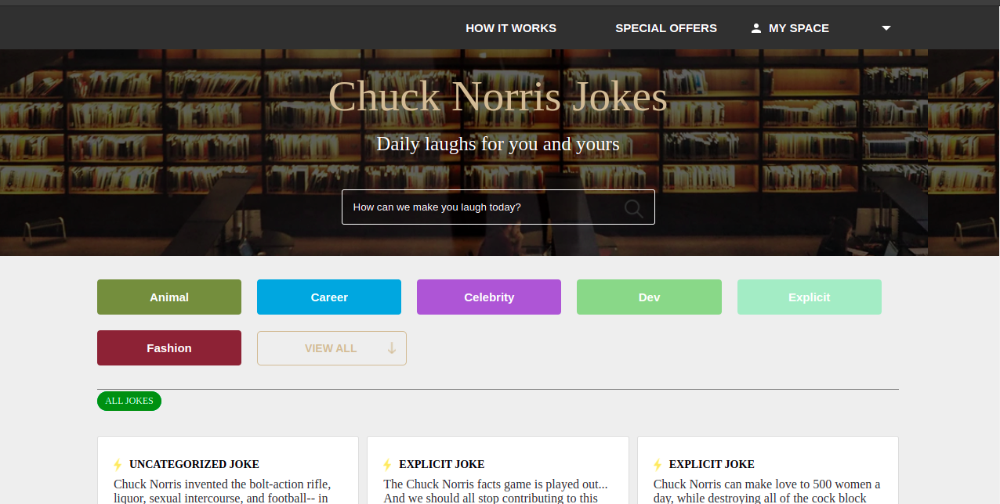

# javascript-capstone

> React app to view a collection of Chuck Norris Jokes.

## Built With

- React
- webpack
- ES6
- SCSS

## Live
View site [here](https://chuck-norris-1465-jokes.netlify.app/)

## API 
[The Chuck Norris Joke](https://api.chucknorris.io)

## Clone Repo

To get a local copy up and running follow these simple steps:

   - `Open terminal Ctrl + Alt + T`

   - `git clone git@github.com:francisuloko/chuck-norris-jokes.git`

   - `cd check-norris-jokes`

   - `npm install`

   - `npm start`

   - `visit localhost:8080`
   

## Author

👤 **Francis Uloko**

- [GitHub](https://github.com/francisuloko)
- [Twitter](https://twitter.com/francisuloko)
- [LinkedIn](https://linkedin.com/in/francisuloko)

## 🤝 Contributing

Contributions, issues, and feature requests are welcome!

Feel free to check the [issues page](https://github.com/francisuloko/chuck-norris-jokes/issues).

## Show your support

Give a ⭐️ if you like this project!

## Acknowledgments

- Alishba Reham

## 📝 License

This project is [MIT](https://mit-license.org/) licensed.
